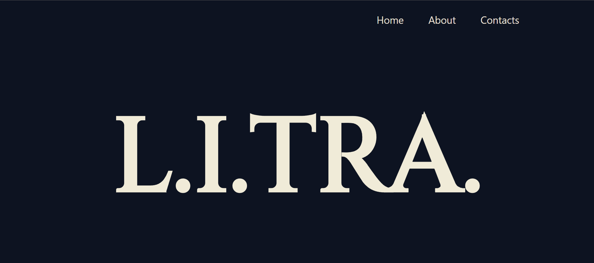
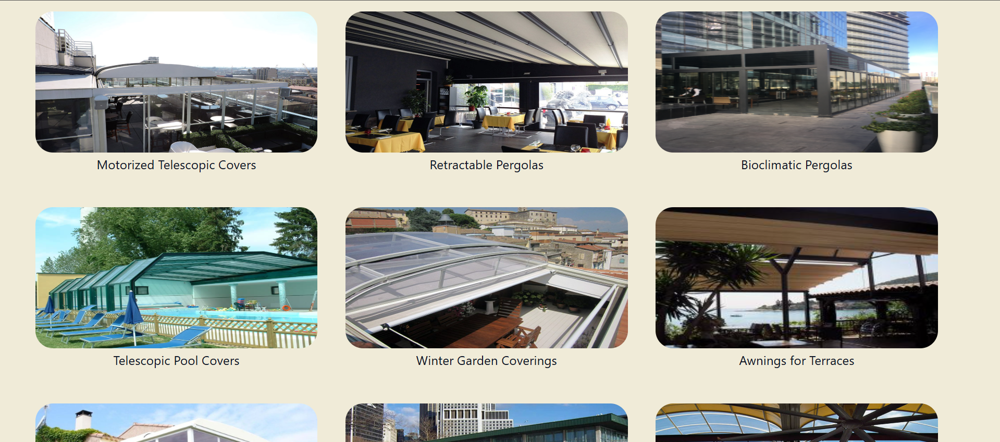
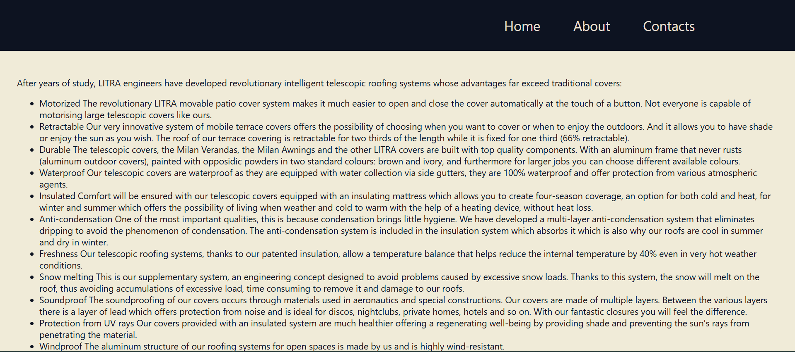
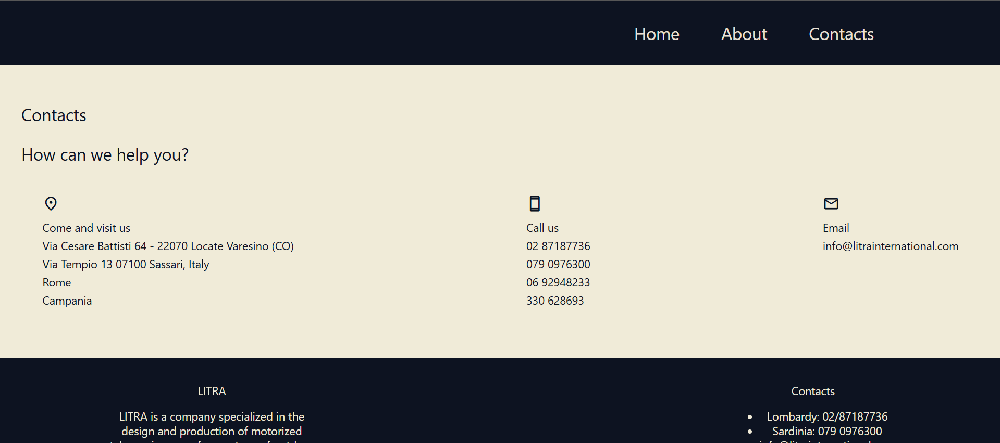

# L.I.TRA.

## First International Project – Freelance Website for an Italian Company

**L.I.TRA. is an Italy-based company specializing in telescopic roofing systems.**  
This was the first website I developed for a foreign client in the freelance space.

The website was built using **React**, with routing managed through **React Router DOM**.  
All work was completed strictly according to the client’s specifications (technical brief), and the client was very satisfied with the final result.

---

## 🏠 Home Page

## 🛠️ Portfolio / Projects Page

## 🏢 About the Company

## 📞 Contact Page

---

## 🔗 Live Website

[Click here to visit the website](https://litra-italy.vercel.app/)